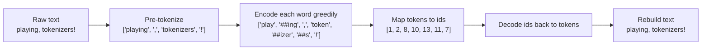
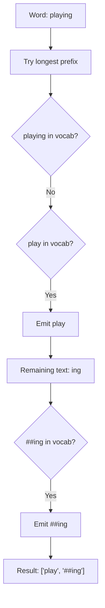

# Tokenizer 101 - For Begginers: WordPiece

A beginner-friendly, deeply explained implementation of the **WordPiece** tokenization algorithm in TypeScript.

This guide is part of [Tokenizer 101 - For Begginers](https://github.com/UtkarshTheDev/tokenizer).

This folder is meant to do two jobs at the same time:

1. show you a working WordPiece tokenizer
2. teach you how WordPiece actually thinks

If you already read the project-level BPE README, think of this as the WordPiece companion guide. It follows the same teaching style, but focuses on the ideas that make WordPiece different from BPE.

---

## Table of Contents

- [Why Do We Need WordPiece?](#why-do-we-need-wordpiece)
- [What Makes WordPiece Different From BPE?](#what-makes-wordpiece-different-from-bpe)
- [The Core Ideas You Must Understand First](#the-core-ideas-you-must-understand-first)
- [A Small Example Vocabulary](#a-small-example-vocabulary)
- [How Encoding Works](#how-encoding-works)
  - [Step 1: Pre-Tokenize the Text](#step-1-pre-tokenize-the-text)
  - [Step 2: Encode One Word at a Time](#step-2-encode-one-word-at-a-time)
  - [Step 3: Convert Tokens to IDs](#step-3-convert-tokens-to-ids)
- [How Decoding Works](#how-decoding-works)
- [What `[UNK]` Means](#what-unk-means)
- [How Training Works in This Project](#how-training-works-in-this-project)
- [Visual Flow of the Whole Pipeline](#visual-flow-of-the-whole-pipeline)
- [A Full Worked Example](#a-full-worked-example)
- [How This Folder Is Organized](#how-this-folder-is-organized)
- [Programmatic Usage](#programmatic-usage)
- [Key Ideas Glossary](#key-ideas-glossary)

---

## Why Do We Need WordPiece?

Neural networks do not understand raw text. They understand **numbers**.

That means a sentence like:

```txt
"playing, tokenizers!"
```

must eventually become something like:

```txt
[1, 2, 8, 10, 13, 11, 7]
```

But how should we split the text before turning it into numbers?

If we split by **whole words**, the vocabulary becomes too large. We would need tokens for:
- rare words
- misspellings
- slang
- names
- code
- many languages

If we split by **single characters**, the vocabulary is tiny, but the token sequences become too long.

So we want something in between:
- smaller than full words
- larger than single characters
- flexible enough to handle unseen words

That middle ground is called **subword tokenization**, and WordPiece is one of the most important subword algorithms.

---

## What Makes WordPiece Different From BPE?

WordPiece and BPE look similar on the surface because both work with subword pieces.

But they think differently.

### BPE mindset

BPE learns a list of **merge rules**:

```txt
"a" + "a" -> "aa"
"aa" + "a" -> "aaa"
"aaa" + "b" -> "aaab"
```

Then, during encoding, BPE **replays those merges in order**.

### WordPiece mindset

WordPiece learns a **vocabulary of valid pieces**:

```txt
play
##ing
##er
##ed
token
##izer
##s
```

Then, during encoding, WordPiece does **greedy longest-match search**:

> "At this position in the word, what is the longest piece from the vocabulary that fits?"

That is the main mental shift.

### Short version

| Algorithm | Learns | Encodes by |
|---|---|---|
| BPE | merge rules | replaying merges |
| WordPiece | a vocabulary | greedy longest matching |

---

## The Core Ideas You Must Understand First

Before reading the code, make sure these ideas are clear.

### 1. A word can be broken into subword pieces

Example:

```txt
playing -> play + ##ing
player  -> play + ##er
played  -> play + ##ed
```

### 2. `##` means "this piece continues a word"

This is the most important WordPiece symbol.

If a token starts with `##`, it means:

> "This piece is allowed only after some earlier piece in the same word."

So:

```txt
play   -> can start a word
##ing  -> cannot start a word
```

That is why:

```txt
playing -> play + ##ing
```

instead of:

```txt
playing -> play + ing
```

### 3. WordPiece uses greedy longest-match search

When WordPiece sees:

```txt
playing
```

it does not say:

> "Let me try every possible segmentation and choose the best one globally."

That would be much more complex.

Instead it says:

1. start at the beginning of the word
2. try the longest possible piece
3. if that piece exists in the vocabulary, take it
4. move forward
5. repeat

This is called **greedy longest-match-first** encoding.

### 4. Unknown words become `[UNK]`

If a word cannot be fully segmented using the vocabulary, this implementation returns:

```txt
[UNK]
```

That means:

> "The tokenizer does not know how to represent this word with the current vocabulary."

---

## A Small Example Vocabulary

Let us use this tiny toy vocabulary:

```txt
[UNK]
play
##ing
##er
##ed
hello
world
token
##izer
##s
,
!
.
```

Now we can tokenize:

```txt
playing    -> play + ##ing
player     -> play + ##er
played     -> play + ##ed
tokenizer  -> token + ##izer
tokenizers -> token + ##izer + ##s
```

But this will fail:

```txt
playful -> [UNK]
```

because:
- `play` exists
- but `##ful` does not

And in this implementation, if a word cannot be fully segmented, the whole word becomes `[UNK]`.

---

## How Encoding Works

Encoding in this project happens in three layers:

1. pre-tokenize the raw text into chunks
2. encode each word-like chunk into WordPiece tokens
3. convert token strings into token IDs

---

### Step 1: Pre-Tokenize the Text

We do **not** run greedy WordPiece matching on the entire raw sentence at once.

Instead, we first split the text into chunks such as:
- words
- punctuation
- URLs
- emails
- numbers

Example:

```txt
"playing, tokenizers!"
```

becomes:

```txt
["playing", ",", "tokenizers", "!"]
```

Why do this first?

Because punctuation and whitespace are not part of the word-level matching logic.  
WordPiece matching works best when it receives one word-like chunk at a time.

This project contains two pre-tokenizers:

- `manualPreTokenizer.ts`
  - a pointer-based learning version
  - easier to study
- `preTokenizer.ts`
  - the practical regex-based version
  - used by the actual tokenizer

---

### Step 2: Encode One Word at a Time

Now let us encode:

```txt
"playing"
```

The algorithm inside `encodeWord()` works like this:

1. set `start = 0`
2. try the longest substring from `start` to the end of the word
3. if `start === 0`, try it as a plain token
4. if `start > 0`, prefix it with `##`
5. if a match is found, emit it and move `start`
6. if no match is found for the current segment, return `[UNK]`

### Example: `"playing"`

```txt
Word: playing
```

Try longest match from the start:

```txt
playing   -> not in vocab
playin    -> not in vocab
playi     -> not in vocab
play      -> yes
```

So emit:

```txt
["play"]
```

Now continue from the remaining part:

```txt
remaining: ing
```

Because we are no longer at the start of the word, try continuation tokens:

```txt
##ing -> yes
```

Final result:

```txt
["play", "##ing"]
```

### Example: `"tokenizers"`

```txt
tokenizers
```

Greedy search:

```txt
tokenizers -> no
tokenizer  -> no
tokenize   -> no
token      -> yes
```

Emit:

```txt
["token"]
```

Remaining:

```txt
izers
```

Try continuation pieces:

```txt
##izers -> no
##izer  -> yes
```

Emit:

```txt
["token", "##izer"]
```

Remaining:

```txt
s
```

Try:

```txt
##s -> yes
```

Final:

```txt
["token", "##izer", "##s"]
```

---

### Step 3: Convert Tokens to IDs

The tokenizer model stores two lookup structures:

- `tokenToId`
- `idToToken`

After string tokens are produced, the tokenizer turns them into integers:

```txt
["play", "##ing", "!"] -> [1, 2, 7]
```

This is the final encoded form used by the rest of the system.

---

## How Decoding Works

Decoding goes in the opposite direction:

1. convert IDs back into token strings
2. rebuild text using WordPiece spacing rules

The key rules are:

- if a token starts with `##`, attach it directly to the previous word
- if a token is punctuation, attach it directly without a leading space
- otherwise, start a new word with a space before it if needed

### Example

```txt
[1, 2, 8, 6, 7]
```

becomes token strings:

```txt
["play", "##ing", ",", "world", "!"]
```

Then decode step by step:

```txt
play     -> "play"
##ing    -> "playing"
,        -> "playing,"
world    -> "playing, world"
!        -> "playing, world!"
```

Final text:

```txt
"playing, world!"
```

---

## What `[UNK]` Means

`[UNK]` stands for **unknown token**.

It appears when the tokenizer cannot fully segment a word using the vocabulary.

Example:

```txt
playful
```

Suppose the vocabulary contains:

```txt
play
##ing
##er
##ed
```

Then:

```txt
play -> yes
##ful -> no
```

So the word fails to segment completely.

In this implementation:

```txt
playful -> [UNK]
```

This is a simple and clear beginner-friendly rule.

---

## How Training Works in This Project

This project includes a learning-oriented WordPiece trainer.

It is not trying to be a production-optimized industrial trainer.  
It is trying to make the algorithm understandable.

### Training pipeline

The training helper functions follow this sequence:

```txt
raw corpus
-> count word frequencies
-> build initial vocabulary
-> collect candidate subwords
-> choose the best candidate
-> grow the vocabulary
-> build a WordPieceModel
```

### Step 1: Count word frequencies

The trainer pre-tokenizes the corpus and counts lowercase word frequencies.

Example:

```txt
"Play playing player played"
```

becomes something like:

```txt
play    -> 1
playing -> 1
player  -> 1
played  -> 1
```

### Step 2: Build the initial vocabulary

The initial vocabulary contains:

- `[UNK]`
- first-position characters as plain tokens
- later characters as `##` continuation tokens

For the word:

```txt
play
```

the initial pieces are:

```txt
p
##l
##a
##y
```

This guarantees that the model can at least spell words character by character.

### Step 3: Collect candidate subwords

The trainer then generates larger possible pieces, such as:

```txt
pl
pla
play
##la
##lay
##ing
##er
##ed
```

Each candidate receives a score based on how often it appears in the training words.

### Step 4: Grow the vocabulary

The trainer repeatedly:

1. finds the best-scoring candidate
2. adds it to the vocabulary
3. repeats until the target vocabulary size is reached

The tie-breaking rule in this project is intentionally simple and deterministic:

1. higher score wins
2. if scores tie, longer normalized subword wins
3. if that also ties, lexicographically smaller token wins

This keeps training runs stable and easy to reason about.

### Step 5: Build the final model

Once the final vocabulary set is ready, it is converted into:

- `tokenToId`
- `idToToken`
- `unkToken`

That becomes the final `WordPieceModel`.

---

## Visual Flow of the Whole Pipeline



### Greedy longest-match view



### Repository diagram

The existing visual diagram in this folder is also included below:


---

## A Full Worked Example

Let us train our intuition with one full sentence:

```txt
"Playing, tokenizers!"
```

### 1. Normalize

The current implementation lowercases text before encoding:

```txt
"Playing, tokenizers!" -> "playing, tokenizers!"
```

### 2. Pre-tokenize

```txt
["playing", ",", "tokenizers", "!"]
```

### 3. Encode each chunk

For `"playing"`:

```txt
["play", "##ing"]
```

For `","`:

```txt
[","]
```

For `"tokenizers"`:

```txt
["token", "##izer", "##s"]
```

For `"!"`:

```txt
["!"]
```

### 4. Combine all WordPiece tokens

```txt
["play", "##ing", ",", "token", "##izer", "##s", "!"]
```

### 5. Convert to IDs

Using the sample model in this folder:

```txt
[1, 2, 8, 10, 13, 11, 7]
```

### 6. Decode back

IDs:

```txt
[1, 2, 8, 10, 13, 11, 7]
```

Tokens:

```txt
["play", "##ing", ",", "token", "##izer", "##s", "!"]
```

Final text:

```txt
"playing, tokenizers!"
```

---

## How This Folder Is Organized

### `types.ts`

Defines the `WordPieceModel` type and includes a small sample model used in tests and examples.

### `manualPreTokenizer.ts`

The educational, pointer-based pre-tokenizer.  
Read this first if you want to understand token boundaries step by step.

### `preTokenizer.ts`

The practical regex-based pre-tokenizer used by the actual tokenizer.

### `trainHelpers.ts`

The training pipeline in small pieces:
- word frequency counting
- initial vocabulary construction
- candidate generation
- tie-breaking
- vocabulary growth
- model construction

### `tokenizer.ts`

The main WordPiece pipeline:
- `encode(text, model)`
- `decode(ids, model)`
- `train(corpus, size)`

### `tokenizer.test.ts`

Small tests that protect the important behavior:
- pre-tokenization
- encoding
- decoding
- round-trip behavior
- unknown token handling

---

## Programmatic Usage

```ts
import { model } from "./types";
import { decode, encode, train } from "./tokenizer";

const ids = encode("playing, tokenizers!", model);
console.log(ids);
// [1, 2, 8, 10, 13, 11, 7]

const text = decode(ids, model);
console.log(text);
// "playing, tokenizers!"

const trainedModel = train("play playing player played", 18);
const trainedIds = encode("playing played", trainedModel);
console.log(trainedIds);
```

---

## Key Ideas Glossary

### Token

A small unit of text represented by an integer ID.

### Vocabulary

The full set of token strings the tokenizer knows how to use.

### Continuation token

A token that starts with `##` and can only appear after an earlier piece in the same word.

### Greedy matching

At each step, choose the longest valid token that fits the current position.

### `[UNK]`

The unknown token used when a word cannot be fully represented by the current vocabulary.

### Pre-tokenization

The step that splits raw text into chunks before WordPiece matching begins.

### Model

The structure that stores:
- token string -> id
- id -> token string
- the unknown token

### Corpus

The text data used to train the tokenizer.

### Normalization before WordPiece

WordPiece benefits a lot from normalization because it matches text using a
string vocabulary. Small input differences can easily change whether a piece is
found in the model.

This project now applies a shared normalization step before WordPiece training
and encoding. The available normalization rules include:

- Unicode normalization
- optional accent stripping
- lowercasing
- collapsing repeated whitespace
- trimming leading and trailing whitespace

So the flow becomes:

```txt
raw text -> normalize -> pre-tokenize -> greedy WordPiece matching
```

Example:

```txt
"  Café   WORLD  "
-> normalize
-> "café world"
```

If accent stripping is enabled:

```txt
"  Café   WORLD  "
-> normalize
-> "cafe world"
```

The most important lesson here is consistency:

- training should use the same normalization rules as encoding later
- otherwise the learned vocabulary and the runtime input can drift apart

### Saving and loading a WordPiece model

For WordPiece, the most important thing to save is the learned vocabulary order.

In this project, that means saving:

- `idToToken`
- `unkToken`
- small metadata like version and normalization info

You may notice that the saved JSON does **not** store `tokenToId`.

That is intentional.

Why?

Because `idToToken` is the canonical saved vocabulary, and `tokenToId` can be rebuilt from it when the file is loaded.

So the mental model is:

```txt
train corpus -> build vocabulary -> save idToToken -> load idToToken -> rebuild tokenToId
```

This is a useful design pattern to learn:

- save the minimum canonical data
- rebuild fast lookup structures at runtime

### Comparing WordPiece with BPE

The project includes evaluation helpers that compare WordPiece and BPE on the
same input text.

For WordPiece, the most useful comparison numbers are:

- **token count**: how many token IDs WordPiece produced
- **compression ratio**: original UTF-8 bytes per produced token
- **unique token count**: how many different vocabulary IDs appeared
- **unknown-token count**: how often WordPiece had to use `[UNK]`
- **unknown-token rate**: what fraction of output tokens were `[UNK]`

The `[UNK]` metrics are especially important for WordPiece.

Why?

Because WordPiece cannot represent a word unless the vocabulary can fully split
that word into known pieces. If the unknown-token rate is high, the vocabulary
is probably too small, trained on mismatched data, or using normalization rules
that do not match the input well.

Beginner mental model:

```txt
WordPiece comparison asks:
"How often could the vocabulary explain this text without falling back to [UNK]?"
```

---

## Final Mental Model

If you remember only one idea, remember this:

> **WordPiece does not replay merge rules like BPE.**
>
> **WordPiece learns a vocabulary, then greedily matches the longest valid pieces from that vocabulary.**

That one sentence is the heart of the algorithm.
